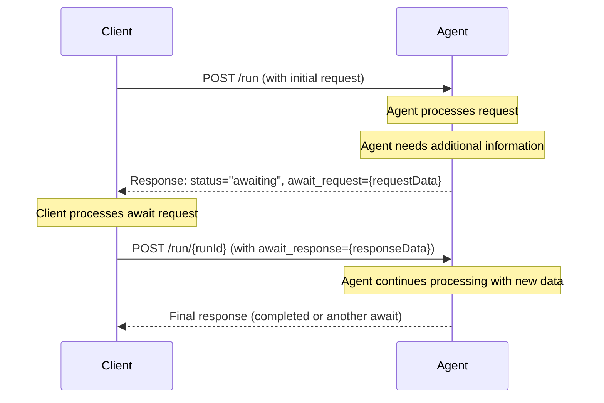

import AlphaWarning from "/snippets/alpha-warning.mdx";

<AlphaWarning />

Agent communication typically involves interactions between two parties, one of which is always an agent, while the other may be another agent, a human interacting through the UI, or, for example, a system interacting via an API.

We refer to the party interacting with the agent as the **Client**.

Communication typically follows a request-response pattern—for example, the Client requests an action from the agent and expects a response upon completion.

However, there are cases where the agent requires additional data or action from the Client to proceed. Examples include confirming if a selected restaurant is acceptable or verifying geolocation data provided by the user's browser. This interaction is what we call **Client in the loop**.

This concept enables the Agent to request specific information from the Client to continue its task. Once the Client provides the necessary data, the Agent resumes its work.

"Client in the loop" is conceptually similar to "Human in the loop," but more abstract, aligning with the ACP since the Client does not need to be a human.

## Awaits

ACP addresses the Client in the loop concept through a mechanism called a **Await**.

The Agent can request a Await, pausing its execution until the Client provides the necessary information to continue.

In the protocol, this is represented by returning a run status of `awaiting`. The Client is then supposed to resume the run and provide the required payload to resolve the Await.

